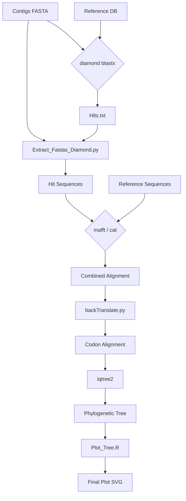

# EvoTools
[](EvoTools.yaml)
[](https://opensource.org/licenses/MIT)

```console
_______           _______ _________ _______  _______  _        _______
(  ____ )|\     /|(  ___  )\__   __/(  ___  )(  ___  )( \      (  ____ \
| (    \/| )   ( || (   ) |   ) (   | (   ) || (   ) || (      | (    \/
| (__    | |   | || |   | |   | |   | |   | || |   | || |      | (_____
|  __)   ( (   ) )| |   | |   | |   | |   | || |   | || |      (_____  )
| (       \ \_/ / | |   | |   | |   | |   | || |   | || |            ) |
| (____/\  \   /  | (___) |   | |   | (___) || (___) || (____/\/\____) |
(_______/   \_/   (_______)   )_(   (_______)(_______)(_______/\_______)
```
**A collection of bioinformatics scripts to streamline the identification and phylogenetic analysis of viral genes.**

Developed By M. Cosentino, 2025.

---

## Table of Contents
- [Workflow Overview](#workflow-overview)
- [Features](#features)
- [Installation](#installation)
- [Example Workflow](#-example-workflow-phylogenetic-analysis)
- [How to Cite](#how-to-cite)
- [Contributing](#contributing)
- [License](#license)

---

## Workflow Overview

This diagram shows the complete data flow, from raw contigs to a final, visualized phylogenetic tree.


---

## Features

This toolkit includes three core scripts designed to automate key steps in phylogenetics.

<details>
<summary><strong>Extract_Fastas_Diamond.py</strong> - Extracts sequence hits from a DIAMOND search.</summary>

This script takes a DIAMOND search output (outfmt 6) and the original nucleotide FASTA file to extract the specific regions that had a significant hit.

| Argument | Flag | Description |
| :--- | :--- | :--- |
| **DIAMOND file** | `--diamond` | Path to your DIAMOND output file (tab-separated outfmt 6). |
| **FASTA file** | `--fasta` | Path to the original query FASTA file. |
| **Output file** | `--output` | Name for the output FASTA file with extracted sequences. |

</details>

<details>
<summary><strong>backTranslate.py</strong> - Creates a codon-aware nucleotide alignment.</summary>

This script back-translates a protein alignment into a corresponding nucleotide alignment, correctly preserving gaps and codons.

| Argument | Flag | Description |
| :--- | :--- | :--- |
| **AA Alignment**| `-ali` | Input aligned amino acid FASTA file. |
| **NT Sequences**| `-nt` | Original unaligned nucleotide FASTA file. IDs must match. |
| **Output file** | `-out` | Name for the resulting nucleotide alignment file. |

</details>

<details>
<summary><strong>Plot_Tree.R</strong> - Visualizes and annotates phylogenetic trees.</summary>

An R script to easily create and customize publication-quality phylogenetic trees using `ggtree`, annotated with metadata.

| Argument | Flag | Description | Default |
| :--- | :--- | :--- | :--- |
| **Tree File** | `-t`, `--tree` | Path to the input tree file (e.g., Newick). | *Required* |
| **Metadata** | `-m`, `--metadata` | Path to a tab-separated metadata file. | *Required* |
| **Output File** | `-o`, `--output` | Path for the output plot (e.g., `My_Tree.svg`). | *Required* |
| **Tips File** | `--tips_file` | A `.txt` file with tip labels to plot a subtree. | `NULL` |
| **ID Column** | `--id_column` | Metadata column matching tree tip labels. | `Acc` |
| **Color Column**| `--color_column`| Metadata column for coloring tip points. | `Genus` |
| **Species Col** | `--species_column`| Metadata column to use as tip labels. | `Species` |
| **Layout** | `-l`, `--layout` | Tree layout (e.g., `circular`, `fan`). | `rectangular` |

</details>

---

## Installation

### Prerequisites
Before you begin, ensure you have **Miniconda** or **Anaconda** installed.

### 1. Clone the Repository
```bash
git clone https://github.com/matheus-cosentino/EvoTools.git](https://github.com/matheus-cosentino/EvoTools.git
cd EvoTools
```

### 2. Create and Activate the Conda Environment
This command uses the `EvoTools.yaml` file to install all dependencies in an isolated environment.
```bash
conda env create -f EvoTools.yaml
conda activate EvoTools
```

### 3. Add Scripts to System PATH (Optional but Recommended)
This allows you to run the scripts from any directory.
* **For Bash (most Linux systems):**
    ```bash
    echo 'export PATH="'$PWD':$PATH"' >> ~/.bashrc
    source ~/.bashrc
    ```
* **For Zsh (macOS and some Linux systems):**
    ```bash
    echo 'export PATH="'$PWD':$PATH"' >> ~/.zshrc
    source ~/.zshrc
    ```
---

## 🧬 Example Workflow: Phylogenetic Analysis

This tutorial demonstrates a complete workflow, from contigs to a final tree.
This workflow was developed to iddentify specific genes (exemplified as Papillomavirus L1 gene from PAVE) within contigs of metagenomic data,

**Required files:**
* `PAVE_L1_nt.translated.fas`: Reference sequences (amino acids).
* `PAVE_L1_nt.fasta`: Reference sequences (nucleotides).
* `Contigs_600pb.fasta`: Your query contigs (nucleotides).
* `metadados.txt`: A metadata file for coloring the tree.

### Step 1: Align the Reference Sequences
```bash
mafft PAVE_L1_nt.translated.fas > Pave_aln_aa.fasta
```

### Step 2: Create a DIAMOND Database
```bash
diamond makedb --in Pave_aln_aa.fasta --db PAVE_L1.dmnd
```

### Step 3: Search for Homologs in Your Contigs
```bash
diamond blastx -q Contigs_600pb.fasta \
               --db PAVE_L1.dmnd \
               --out Hits.txt \
               --outfmt 6 \
               --query-cover 50 \
               -k 1
```

### Step 4: Extract the Hit Sequences
```bash
Extract_Fastas_Diamond.py --diamond Hits.txt \
                          --fasta Contigs_600pb.fasta \
                          --output L1_Hits.fasta
```

### Step 5: Combine Sequences and Re-align
```bash
# Combine nucleotide sequences
cat L1_Hits.fasta PAVE_L1_nt.fasta > Total_PV_Nt.fasta

# Add amino acid sequences to reference alignment
# (Assumes you have a translated version of your hits, i recommend Aliview https://ormbunkar.se/aliview/)
mafft --add L1_Hits.translated.fas Pave_aln_aa.fasta > AA_Aln_PV_all.fasta
```

### Step 6: Back-translate the Alignment
```bash
backTranslate.py --nt Total_PV_Nt.fasta \
                 --ali AA_Aln_PV_all.fasta \
                 --out NT_Aln_PV.fasta
```

### Step 7: Build the Phylogenetic Tree with IQ-TREE
```bash
iqtree2 -s NT_Aln_PV.fasta \
        -m GTR \
        -B 10000 \
        -alrt 10000 \
        -nt 6
```

### Step 8: Visualize the Tree
Finally, generate a publication-quality image of your tree.
```bash
Plot_Tree.R -t NT_Aln_PV.fasta.treefile \
            -m metadata.txt \
            --color_column Host \
            --id_column Acc \
            --species_column Species \
            -l circular
```
The result is a fully annotated phylogenetic tree.


---
##  How to Cite
If you use EvoTools in your research, please cite this repository:
> Cosentino, M. (2025). EvoTools: A collection of bioinformatics scripts for viral gene analysis. GitHub. https://github.com/matheus-cosentino/EvoTools

##  Contributing
Contributions, bug reports, and feature requests are welcome! Please open an issue on the GitHub repository to discuss any changes.

##  License
This project is licensed under the MIT License. See the `LICENSE` file for details.

